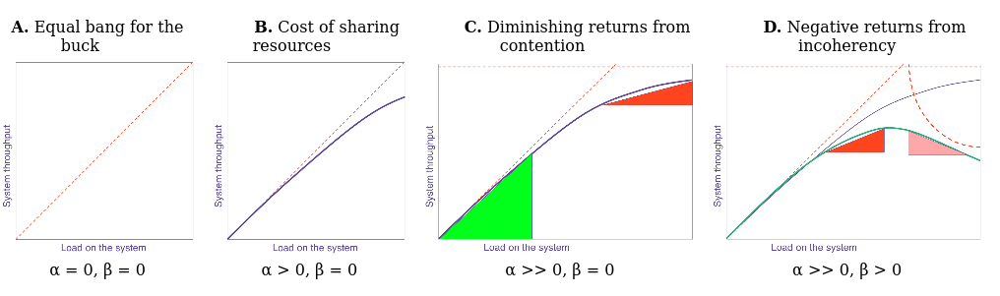

# sled performance guide

[](https://github.com/spacejam/sled)
[](https://docs.rs/sled)
[](https://discord.gg/Z6VsXds)
[](https://github.com/sponsors/spacejam)

WARNING: Viewer discretion is advised.

## executive summary

* make it work, then make it pretty, then make it fast
* only do things that are necessary for correctness and safety
* your engineers will burn out, leave your team, and relentlessly shit talk you
  if they don't make their code pretty
* align all latency-throughput queuing positions for everything in the
  serial dependency graph, or you will get worst-of-all-worlds
  latency-throughput behavior, increasing latency and lowering throughput
* if something necessary can be done in the background without blocking,
  queue it up for eventual batch processing to improve cache performance
* look at allocation lifetime using DHAT, avoid short-lived allocations
  and ensure that long-lived allocations employ time-space trade-offs
  that consume plentiful resources instead of scarce ones where possible
* seriously, it's always your fault if your engineers quit.
* performance happens naturally when engineers love the codebase and they
  are aware of which parts of the system can be sped up
* before wasting time optimizing things that don't matter, we can easily test
  whether optimizing could be useful at all by adding delays or deleting
  relevant code to see what the impact of infinite optimization would be
* by default your machine will randomly change your cpu frequency, yank
  processes across cores and sockets, and generally make measurements
  deceptive and non-reproducible. we can control this behavior. if you
  don't account for this behavior, your measurements are not sound justifications
  for code changes
* wait, why does an executive care about performance, anyway?

## non-executive introduction

Ok, now that the executives are gone, it is time to party.

Let's put on some nice music.

<iframe width="560" height="315" src="https://www.youtube.com/embed/GEaEX7AjMKo" frameborder="0" allow="accelerometer; autoplay; encrypted-media; gyroscope; picture-in-picture" allowfullscreen></iframe>


Take a deep breath.

Let it out.

The year is 2020. and we are utterly fucked.

Supposedly we are here reading this article because we "like computers" or
something but let's be clear about one thing - you're not here because of that.
I know. You know. We all know. You couldn't give two fried pennies about
computers if they didn't help you feel the things you so desperately need to
feel.

You're here, ultimately, because of control. Your entire life is entombed
in an elaborate, entirely abstract labyrinth of machines that define so
many aspects of every moment of your waking life. You're here to better
understand the prison you find yourself within. You're here to sympathize
with the machine.

While you will only seep ever more deeply into this morass of gold and glass,
you have the power to turn your captors into familiar friends. You have the
power to make the machines into the only friends you will ever need. You are
here to abandon the organic and the analogue. There is nothing for you on the
other side of your window. As you lounge (please fix your posture now) in your
designated quarantine pit, gazing listlessly into the LED mesh while biding
your time, I invite you to join me - your newest simulated human experience -
on a once-in-a-lifetime adventure into the bowels of the machine through which
you experience joy and place orders for more toilet paper.

It begins today.


This guide contains basic information for getting started with
performance-sensitive engineering. This guide also contains low-level
information that will help you to better understand your partners. I think most
folks will learn something new. I know I have. And, part of why I wrote this is
to have a single place with a memorable URL where I can return to when I forget
most of this stuff. Most importantly, when I unfurl fiery screeds in random
internet comments I want to have an intimidating reference to which I can
mercilesly link.

I initially wrote this guide for the Rust ecosystem, where many people are now
trying their hands at optimization for the first time. But nearly all of this document
applies to general programming, with a few of the hardware effects mentioned
being specific to x86 and linux circa 2020.

This guide brings together ideas from systems engineering, systems theory,
psychology, hardware, queuing theory, statistics, economics,
distributed systems, concurrency and philosophy of science with the goals of
helping you to be less of an asshole and write code that tends to improve
the metrics you care about.

Performance is about being thoughtful about the metrics that matter to us and
allowing ourselves to be aware of them while making decisions.

These materials are based on Tyler Neely's Rust workshop content, and have been
inspired by the writings of
[Dmitry Vyukov](http://www.1024cores.net/home/parallel-computing/cache-oblivious-algorithms),
[Mark Callaghan](http://smalldatum.blogspot.com/2019/05/crum-conjecture-read-write-space-and.html),
[Brendan Gregg](http://www.brendangregg.com/usemethod.html),
[Martin Thompson](https://mechanical-sympathy.blogspot.com/2013/02/cpu-cache-flushing-fallacy.html),
[Pedro Ramalhete](http://concurrencyfreaks.blogspot.com/2019/11/is-left-right-generic-concurrency.html)
and others.

## shameless, emotionally annihiliating begging

My workshops have been the primary means of supporting sled development costs.
Unfortunately, the workshops are now on hold due to coronavirus concerns. If
you feel like this information is useful, please consider [supporting my
efforts](https://github.com/sponsors/spacejam) to share knowledge and
productionize cutting edge database research with implementations in Rust :)

I love you.

# contents

Let's kick this shit up! Here's what it's gonna look like...

* ##### CHAPTER 0b000: MODELS, MEASUREMENTS AND MINDS
  * [principles](#principles)
  * [metrics: latency, throughput, utilization and saturation](#metrics)
    * [latency vs throughput](#latency-vs-throughput)
    * [measuring latency](#measuring-latency)
    * [productivity](#productivity)
    * [case study: sled](#sled-case-study)
  * [experimental design](#experimental-design)
    * [experiment checklist](#experiment-checklist)
  * [e-prime and precise language](#e-prime-and-precise-language)
* ##### CHAPTER 0b001: UR ASS IS IN TIME AND SPACE
  * [concurrency and parallelism](#concurrency-and-parallelism)
  * [amdahl's law](#amdahls-law)
  * [universal scalability law](#universal-scalability-law)
  * [trade-offs](#trade-offs)
    * [the RUM conjecture](#the-RUM-conjecture)
    * [memory pressure vs contention](#memory-pressure-vs-contention)
    * [speculation](#speculation)
    * [scheduling](#scheduling)
* ##### CHAPTER 0b0010: THE MACHINE
  * [computation](#computation)
  * [threads](#threads)
  * [syscalls](#syscalls)
  * [flash storage](#flash-storage)
  * [network stacks](#network-stacks)
  * [cache](#cache)
  * [frequency scaling](#frequency-scaling)
  * [branch misprediction](#branch-misprediction)
  * [branch target misprediction](#branch-target-misprediction)
  * [4k aliasing](#4k-aliasing)
  * [bandwidth saturation](#bandwidth-saturation)
  * [cache conflicts](#cache-conflicts)
  * [cache/memory hierarchy bandwidth](#cache/memory-hierarchy-bandwidth)
  * [data dependencies](#data-dependencies)
  * [denormal floating point numbers](#denormal-floating-point-numbers)
  * [DRAM refresh interval](#DRAM-refresh-interval)
  * [false sharing](#false-sharing)
  * [hardware prefetching](#hardware-prefetching)
  * [memory-bound program](#memory-bound-program)
  * [misaligned accesses](#misaligned-accesses)
  * [non-temporal stores](#non-temporal-stores)
  * [software prefetching](#software-prefetching)
  * [store buffer capacity](#store-buffer-capacity)
  * [write combining](#write-combining)
* ##### CHAPTER 0b011: ANAL TOOLZ
  * [visualizing time with flamegraphs](#flamegraphs)
  * [modeling CPU behavior with llvm-mca](#llvm-mca)
  * [determining viable optimizations with coz](#coz)
  * [allocation lifetime analysis with dhat](#dhat)
  * [heap profiling with massif](#massif)
  * [top-down analysis with toplev](#top-down-analysis)
  * [CPU cache simulation with cachegrind](#cachegrind)
* ##### CHAPTER 0b100: TECHNIQUE
  * data structure design
  * critical path analysis
  * concurrency
  * parallelism
  * batching
  * flat-combining
* ##### CHAPTER 0b101: RUST
  * allocation analysis with the `GlobalAlloc` trait
  * [async tasks](#async-tasks)

# IT BEGINS

# CHAPTER 0b000: MODELS, MEASUREMENTS AND MINDS

## principles

```
You are not a Bayesian homunculus whose
reasoning is “corrupted” by cognitive biases.

You just are cognitive biases.
```

[- Luke Muehlhauser, via R:AZ](https://www.readthesequences.com/Rationality-An-Introduction).

The first thing to consider is that our minds are pure shit and everything we
know is wrong. We must accept our fallibility before embarking down the path to
fast-as-fuck machinery.

We build towers of assumptions that are bound to specific contexts, and when the
conditions that caused us to form these beliefs change, we tend not to revisit
the now-invalidated beliefs. Cache invalidation is hard when we are so rarely
aware of the dependency graphs of what we believe.

So, we measure. Even when we're convinced that we're right. Because we are
always out of sync with reality, and we are fundamentally incapable of altering
this fact. But we can be responsible in the face of that.

Corollary: allow yourself to be wrong. Allowing yourself to be wrong with
yourself, your collaborators, and in public is a key optimization for learning
faster and building better things with less effort and in less time.

Luckily for us, machines tend to be somewhat amenable to measurement. We built
them that way. Indeed, constructing them to be somewhat measurable in the first
place was the only way we were able to assemble them at all despite our
innumerable shortcomings. We took the predecessor to your current machine,
chose some metrics to improve, made a huge number of mistakes while continuing
to measure, and occasionally we got lucky: the metrics we cared about improved
enough to alter production lines, crystallizing our occasionally successful
results into new production processes that eventually put your machine in front
of you.

We must measure.

The only thing that matters is that real programs on real hardware see real
improvements in relevant metrics like total cost of ownership, responsiveness,
etc... If a metric doesn't help a human, it's just a vanity pursuit that may
make the important metrics worse due to under-investment.

We must select our measurements with care. Our time is precious.

By making decisions that are considerate of available data, we are able to cut
through so much bullshit. We have so many ideas that our experience tells us
should cause our code to improve, but it simply isn't true when we actually
measure. Code changes that made your Java, C++, Haskell or JS programs faster
may not make Rust any faster. Don't make Rust code ugly just because some
program you wrote in the 90s worked better with [manual loop
unrolling](https://en.wikipedia.org/wiki/Duff%27s_device). Compilers change,
in many ways for the better.

Don't be macho. Make decisions while having real data on-hand and limit the
damage of hubris.

## metrics

Performance metrics come in many shapes and sizes. Workloads will have a few
metrics that matter far more than others.

It's at this point that I'm obligated to bash
[benchmarketing](http://smalldatum.blogspot.com/2014/06/benchmarketing.html),
but honestly it's often an important tool for projects to see success - you
just need to be clear about what your metrics actually are. Don't trick people.
Give people the means to reproduce your findings. All that good science shit.

Most systems performance metrics boil down to these:

* latency - the time that an operation takes
* throughput - how many operations can be performed in some unit of time
* space - whoah.

At higher scales, these metrics become factors in major concerns like:

* total cost of ownership
  * how many servers do I need to pay for to get my shit done?
  * how many hours do engineers spend taking care of this shit?
  * how much power does this shit draw?

Quick aside - as of 2020, cloud providers tend to under-charge for compute
(ec2, lambda, etc...) in an effort to increase your reliance on their more
expensive storage products. A concept of "data gravity" exists where your
compute must stay where the storage is. You can't move your compute to a
different cloud provider if your data is stuck in the old one. And egress
traffic is taxed heavily to make it more painful to get out. And where your
compute exists, more data is likely to be produced, increasing the
gravitational field. Make sure your back-of-the-napkin calculations for
running infrastructure somewhere take account of the storage costs primarily.
Engineers love using the fancy hosted databases like Spanner, but the
cost per byte stored is astronomical. BE AWARE.

In trying to determine how many servers do I need to pay for to get my shit
done, we need to consider latency, throughput and required space (memory and storage).

If we have 1000 requests arriving per second at an exponential distribution (as
opposed to one arriving each millisecond on the dot), our system actually needs
to process requests faster than one each millisecond. Queue theory tells us
that as our arrival rate approaches our processing rate, our queue depth
approaches infinity. Nobody's got that kind of time to lay around in line to
be served. Queue theory provides a number of key intuitions for reasoning about
the relationship between latency and throughput. See [this
site](https://witestlab.poly.edu/blog/average-queue-length-of-an-m-m-1-queue/)
for pretty graphs illustrating this on an
[M/M/1](https://en.wikipedia.org/wiki/Kendall%27s_notation) queue analyzing a
network system.

In real-world systems, arrivals happen in difficult-to-predict but
acceptable-to-model distributions that often resemble exponential or Zipfian
distributions. These queue length explosions really do happen, even when
nothing is really wrong. They are normal and should be planned for by being
careful about TCP backlog lengths (usually set to be too large), timeout
durations (usually set to be too long), retry strategies (*truncated*
exponential backoffs), circuit-breaker patterns, etc...

Some other important general-purpose metrics are:

* utilization - the proportion of time that a system (server, disk,
  hashmap, etc...) is busy handling requests, as opposed to waiting for the
  next request to arrive.
* saturation - the extent to which requests must queue before being handled
  by the system, usually measured in terms of queue depth (length).

### latency vs throughput

Latency and throughput considerations are often in direct contradiction with
each other. If we want to optimize the throughput of a server, we want to
increase the chance that when a server is finished processing one request that
it already has another one lined up and ready to go. 100% utilization means
that the server is always doing useful work. If there is not work already
waiting to be served when the previous item completes, the utilization drops,
along with the throughput. Having things waiting to go in a queue is a common
way to increase throughput.

But waiting (saturation) is bad for latency. All other things being equal,
sending more requests to a system will cause latency to suffer because the
chance that a request will have to wait in line before being served will
increase as well. If we want to minimize the latency of a server, we want to
increase the chance that there is an empty queue leading into it, because
waiting in that queue will slow down each request.

Latency vs throughput is a fundamental relationship that has tremendous
consequences for performance-sensitive engineering. We are constantly faced
with decisions about whether we want our requests to be fast, or if we want the
system to generally handle many requests per second, with some being quite
slow due to waiting so long in the queue.

If you want to improve both latency and throughput, you need to make the unit
of work cheaper to perform.

Different systems will have different relationships between utilization and
saturation. Network adapters are often designed to be able to keep receiving
more and more work and avoid saturation until relatively high utilization.
Other devices, like spinning disks, will start saturating quite quickly,
because the work causes other work to get slower by needing to drag the disk
spindle to another physical location before it's able to handle the request.
Here's a place where smart scheduling can make a huge difference for the
relationship between utilization and saturation. Most modern storage
devices based on flash memory are essentially distributed databases
where every 32mb is a different shard, so you can get a lot of throughput
without immediate negative saturation by keeping the queue depths pretty
deep, so more of the distributed chips in the device can do work at once.

A critical insight is that if you have a system that you wish to optimize
for low latency, it is helpful if the subsystems that it depends on are
also optimized for latency. If you are serving user requests where you
want to minimize response time, you probably want to avoid having that
response depend on an analytical database tuned for batch performance
instead of low latency. If you want to process trillions of records
in some low amount of time without caring much about the time to process
a particular record, you probably want to rely on systems that
have been tuned for throughput at the expense of latency.

All systems have specific latency-throughput trade-offs. When your
system depends on subsystems in the critical path where different
latency-throughput trade-offs were made, your overall system will
behave worse. If you force a latency-bound user-facing response
to go through a kafka queue before their web browser loads the
result, you are introducing a throughput-bound dependency
into the critical path of a latency-bound workload, and the
result will be a worse experience. We should use low-latency
dependencies in the critical paths of low-latency workloads. We should use high-throughput
dependencies in the critical paths of high-throughput workloads. Mixing and
matching systems in our critical paths without evaluating their queuing
characteristics is likely to result in terrible performance.

The authors of the frameworks you're using probably don't understand these
basic engineering principles. Measure what's happening and keep your
queuing behaviors aligned and your system will fly.

Under light load, throughput-bound systems can sometimes scale down to reduce
buffering and achieve lower latency at lower loads. [Andrea
Lattuada](https://twitter.com/utaal) mentioned a great example of an
auto-tuning system to me: a throughput-oriented system can take the entire
queue of new requests, process them in a batch, and generally keep picking the
queue length as the batch size where possible. This auto-tunes the batch size
to be low (reducing latency) when there is a small request volume coming in.
This yields nice low latency requests when the volume of requests is low, but
allows the system to scale up and take advantage of batch optimizations as the
request rate increases. Latency suffers as load increases, because in this
case, latency is not a high priority.

An auto-tuning low-latency system must scale something other than the queue
length when throughput increases if it is going to keep maintaining low
latency. Low-latency is dependent on keeping the the amount of time waiting in a
queue beneath a desired threshold. So, instead of increasing the batch size, we
must increase the amount of parallelism by using more cores, more servers,
etc... However, as [Amdahl's Law](#amdahls-law) and
[USL](#universal-scalability-law) show, we can only parallelize a program by a
certain amount, and the very act of parallelization will impose additional
costs which could negate any possible gains from parallelization.

It is important when building a system to be aware of whether your
goal is to keep requests processing at low-latencies or at
high-throughputs, because this should have a huge impact on your
design, your dependencies, your scaling techniques, etc...

Be aware of where your system stands on this spectrum.

Further reading:

* http://www.brendangregg.com/usemethod.html
* Systems Performance: Enterprise and the Cloud by
  Brendan Gregg (buy the book just to read chapter 2: Methodology)
* Quantitative Analysis of Computer Systems by Clement
  Leung - awesome intro to queue theory.

### measuring latency

In the process of satisfying a request of some sort, a system will often rely
on other systems. A database relies on a kernel to schedule its threads onto
CPUs and provide access to storage. We can learn about what causes a database
to be slow by learning about what causes its subcomponents and interactions
with other systems to be slow.

If you're measuring latency for a large number of requests, there are a number
of ways that you can derive meaning from measurements. People often rely on
averages to make sense of a large number of measurements. But the average is
not very interesting for our highly discrete computer systems because it hides
the impact of outliers and gives us no insight into the distribution of data.
Things like normal curves and t-tests do not apply for data which do not follow
normal distributions. Determining what our distribution looks like at all is
part of our work.

We usually use histograms so that we can understand the distribution of our
data. The 0th percentile is the minimum measurement. The 100th percentile is
the maximum measurement. The 50th percentile is the median, where half of all
measurements are beneath and half of all measurements are above. The 90th
percentile is the latency that 90% of all measured latencies are less than or
equal to. It's pretty cheap to measure histograms by using logarithmic
bucketing to index into an array of buckets that are sized to be within 1% of
the true observed values. The [historian](http://docs.rs/historian) crate was
extracted from sled to assist with these measurements in a super cheap manner.

Imagine this scenario:

* a front-end system sends 100 requests to a back-end system
* the front-end system is able to send each request in parallel
* the latency distribution for the back-end system is a
  steady 1ms until the 99th percentile where it jumps to 1s.
* the front-end system must wait for the slowest response
  before it can respond to the user

How long does the front-end system need to wait for?

The probability of needing to wait 1 second for a single request is 1% (99th
percentile is 1s). The probability of needing to wait 1 second for 2 requests is
1.9% (`1 - (0.99 ^ 2)`). Intuition: if we sent 1,000,000 requests, the
percentage would not become 1,000,000 * 1%, or 10,000%, because 100% is the max
probability an event can have. For this example, everything between the 99th
and 100th percentiles is exactly 1 second. All of our slowest 1% of requests
take 1 second.

The probability of needing to wait 1 second for 100 requests is `1 - (0.99 ^
100)`, or 63%. Even though the event only happens 1% of the time, our front-end
system will have to wait 1 second in 63% of all cases, due to needing to send
multiple requests.

Our systems are full of subcomponents that are accessed many times to satisfy a
higher-level request. The more often something happens, the higher the
percentile we should care about is. For many workloads, looking at the 100th
percentile (max measurement) is quite helpful, even though it only happened
once, because it can help to motivate capacity planning for other systems that
depend on it.

Further reading:

* [The Tail at Scale by Jeff Dean](https://cseweb.ucsd.edu/~gmporter/classes/fa17/cse124/post/schedule/p74-dean.pdf)

### productivity

 ```
 The computer is so powerful and so useful
 because it has eliminated many of the
 physical constraints of electromechanical
 devices. This is both its blessing and its
 curse: We do not have to worry about the
 physical realization of our software designs,
 but we also no longer have physical laws the
 limit the complexity of these designs—the latter
 could be called the curse of flexibility
 - Nancy Leveson, 1995
 ```

One of the most frequently overlooked performance metrics is the cognitive
complexity of a codebase. If engineers experience high friction when trying to
change a codebase, all efforts to make the code faster will be dramatically
hindered. A codebase that is a joy for engineers to work with is a codebase that
will see the most long-term optimizations. Codebases that burn people out will
not see long-term success unless they receive tons of funding to replace people
who flee the project after short periods of activity. [Organizational
instability is a high-quality predictive metric for the bugginess of a
codebase](https://www.microsoft.com/en-us/research/wp-content/uploads/2016/02/tr-2008-11.pdf).

Putting energy into reducing the complexity of your code will often make it:

* easier for humans to read (hence faster for them to optimize over time)
* easier for compilers to optimize due to being smaller
* faster to compile at all, resulting in a more responsive edit-measure
  loop, resulting in more optimizations per human time unit spent
* have less machine code, improving instruction cache at runtime
  (especially when running outside of microbenchmarks that conceal
  realistic cache effects)

"Experts write baby code." - Zarko Milosevic

So, we must pick our meaningful metrics, measure them after considerate
[experimental design](#experimental-design), make decisions while having these
results at hand, and repeat.

Our unmeasured assumptions are incorrect. Optimizing without measuring is how
you end up with unmaintainable codebases that have been inflicted by many
displays of "performative-optimization" written with the metric of "demonstrates
intellectual superiority" over metrics like "long-term collaborator happiness".

Let's strive to be clear about our metrics, at the very least.

### sled case study

Here are some other metrics that are interesting for sled:

* Single operation worst case latency: this is our primary metric because we
  are prioritizing transactional workloads above analytical workloads. We want
  users to have reliably responsive access to their data. We pay particular
  attention to the very worst case latency because it is fairly important from
  an operational perspective. We sometimes choose to sacrifice better average
  latency in order to improve the latency at high percentiles, to increase
  the overall dependability of the system.
* Peak memory utilization: we want a high fraction of all allocated memory to
  be made up of user data that is likely to be accessed. This lets us keep our
  cache hit rates higher given the available memory, reducing the latency of
  more operations.
* Recovery latency. How long does it take to start the database after crashing?
* Peak memory throughput: we want to avoid short-lived allocations that may be
  more efficiently stored on the stack. This also allows us to have more
  predictable latency as our memory usage grows, because most allocators start
  to degrade in various ways as they are pushed harder.
* Bulk-loading throughput: we want users to be able to quickly insert large
  amounts of data into sled quickly so they can start using it.
* Peak disk space utilization: we don't want sled to use 10x the space that
  user data requires. It's normal for databases to use 1-2x the actual data
  size because of various defragmenting efforts, but we reduce the number of
  deployment possibilities when this "space amplification" is high.
* Peak disk throughput: there is a trade-off between new data that can be
  written and the amount of disk throughput we spend rewriting old data to
  defragment the storage file and use less total space. If we are careful
  about minimizing the amount of data that we write at all, we can increase
  our range of choice between smaller files and higher write throughput.
* Disk durability: the more we write data at all, the sooner our drives will
  die. We should avoid moving data around too much. A huge amount of the work
  of building a high quality storage engine boils down to treating the disk
  kindly, often at the expense of write throughput.

In sled, we measure histograms using code that was extracted into the
[historian](https://docs.rs/historian) crate. We also output [a table of
performance-related information when configured to do
so](https://twitter.com/sadisticsystems/status/1229302336637558785). Having a
profiler built-in makes finding bottlenecks quite easy, and in a quick glance
it's easy to see where optimization effort may be well spent.

## experimental design

Experimental design is about selecting meaningful workloads and metrics,
avoiding bias and achieving reproducible results without wasting too much time.

Simply measuring the runtime of a workload before and after applying a diff is unsound
because there are so many other variables that impact performance.

Your machine does some things that might not be obvious, which will change your
measurements:

* [CPU frequency scaling](#frequency-scaling)
  * CPUs will burst to high frequencies for short periods of time to make short tasks run quicker
  * CPUs will cut dramatically lower their frequencies to use less power over time
  * CPUs will cut dramatically lower their frequencies to generate less heat over time
  * did better compilation cause your CPU to heat up? your **better** code may run **slower** afterwards
  * is your laptop running on battery? **better** code may run **slower**
  * p-state scaling may be disabled if using the intel_pstate driver by setting the
    linux kernel boot command argument `intel_pstate=no_hwp`
  * turbo boost can be disabled by setting
    `echo 1 | sudo tee /sys/devices/system/cpu/intel_pstate/no_turbo` if
    running with intel_pstate or `echo 0 | sudo tee
    /sys/devices/system/cpu/cpufreq/boost` if using acpi
* is the data you're reading from disk already in the OS pagecache?
  * your kernel keeps a lot of recently accessed file data in memory to speed up future accesses
  * the second run of a program that reads data from disk doesn't pay the disk costs. **better** code may run **slower** than slower code with a warmed cache
  * pagecache can be dropped via `sync && echo 3 | sudo tee /proc/sys/vm/drop_caches` (thanks [@vertexclique](https://twitter.com/vertexclique))
* is your memory becoming more fragmented?
  * system-wide memory can be compacted via `echo 1 | sudo tee /proc/sys/vm/compact_memory` (thanks [@knweiss](https://twitter.com/knweiss))
* [The linking order used to combine otherwise identical compiled code objects when creating a binary](https://users.cs.northwestern.edu/~robby/courses/322-2013-spring/mytkowicz-wrong-data.pdf)
  * can result in 10% more cycles with zero code changes. **better** code may run **slower**
* [yelling near your computer](https://www.youtube.com/watch?v=tDacjrSCeq4)
  * having too much fun? **better** code may run **slower**
* [Are you accessing different memory locations that are 4k apart?](#4k-aliasing)
* If the kernel pulls your thread to a different socket than the one that
  initially allocated a bunch of memory, the latency to keep accessing that
  memory will explode.
  * threads can be pinned to specific cores on specfic sockets to avoid
    being migrated to another socket.

If an experiment were a pure math function, changing our input variables would
be the only thing that would influence the change of our observed outputs.
Unfortunately, our systems are quite complex, and there are many factors which
may influence the quality of our measurements.

Experimental design is at the heart of our quest to determine if our code
changes made our system better according to our chosen metrics.

How do we measure our metrics? We seek to make our programs more efficient by
changing code. Running a program twice will result in two different
measurements. But the difference in performance is NOT necessarily because the
code is faster for realistic workloads.

Many code changes that run faster in microbenchmarks will run more slowly when
combined with real program logic because the microbenchmark is able to use
a lot more CPU cache than it would be able to when running with a real
workload.

You can think of this as being similar to the "multi-tenancy" performance
issues that we struggle to deal with in distributed systems engineering. The
same applies even more to single-threaded code which radically changes due to
the amount of cache it has access to.

Very often, faster code is only faster for a few moments before it causes
frequency scaling to kick in aggressively due to heat generation. There have
been some infamous cases where using SIMD causes CPUs to heat up more, causing
frequency scaling to kick in more, and result in a slower system when running
for longer periods of time. Even without frequency scaling kicking in, faster
code often consumes more heat, as well. Maybe a 3% throughput improvement is
not worth a 100% power consumption increase.

Failing to exercise experimental discipline will result in a lot of
"optimizations" that are assumed to improve the situation but in fact only add
complexity to the codebase, reducing maintainability, and making it harder to
properly measure future optimizations.

One of the most basic techniques: don't just run a workload once:

Bad:

```
* time compile and run workload 1
* time compile and run workload 2
* compare total times
```

The above method is extremely common, especially by people changing
code and running measurements on their laptops without disabling
any frequency scaling features.

We need to be careful about being biased by the compilation itself.
Frequency scaling can kick in when a compiler works harder to
produce more optimized binaries. If the compiler worked much harder
to produce a better binary, the CPU frequency may be lower
and any subsequent measurements might be much lower.
Faster code will appear slower.

Better:

```
* disable frequency scaling and turbo boost
* close slack. close your web browser.
* kill as many non-essential processes as you can get away with.
* unset as many environment variables as possible (see papers below, it matters)
* compile workload 1
* compile workload 2
* time workload 1
* time workload 2
* time workload 1
* time workload 2
...
* time workload 1
* time workload 2
* view distribution of results
```

By running workloads interleaved with each other, we reduce the risk
of having particular transient system-wide effects impact only a single
measurement.

By taking multiple measurements, we improve our understanding of the
distribution of possible results given our current configuration.

However, our goal is to increase the chances that we have established
a causal link between our code changing and our desired metrics improving.
There are many variables that we are always ignorant of. If we want to be
more confident that our system is actually better, we can gather corroborating
evidence that can help explain the measured effect.

There are a lot of things that happen in between your code changing and
a timing metric changing. A compiler transforms the code into machine code.
Machine code is linked together in a certain order (causing up to a 10% performance
impact due to link order alone, see papers below). Then when we run the binary,
we load the various code objects into memory at addresses which may be effected
by ASLR, further introducing a considerable amount of variance. Anything
that impacts memory layout could have a strong impact on the effectiveness
of our memory [caches](#cache), which use a lot of heuristics to predict
which memory you may access next, and these may be impacted by changes
in physical memory allocation during the run of a workload. Your CPU will
run when it has instructions and data to zip together, but it really spends
a huge amount of time just waiting around for its dependencies to arrive.
Whenever your instructions and data finally show up, your CPU will execute
them in creative ways that are later verified to conform to the dependency
structure communicated through the compiled machine code, although they are
often thrown away due to finding out that some data dependency has changed
because of what some other CPU core published to the shared cache coherency
subsystem.
We'll get into this stuff in gory detail below in the [cache](#cache) section.
Importantly, the CPU will update a lot of its own performance counters
as these various operations occur.

For our intermediate memory statistics, allocators like [jemalloc expose many
metrics](https://github.com/jemalloc/jemalloc/wiki/Use-Case%3A-Basic-Allocator-Statistics)
which can help us to explain changes in our measured resident set size.

Verifying that these intermediate metrics also change in significant ways can
help us to increase our confidence in the causal link between changed code and
changes in high-level metrics like overall workload throughput, high-level
operation latency, overall process memory resident set size, etc... In
general, the higher-level the metric, the more intermediate metrics may be
helpful in attempting to account for the change. The more complex the
system you're changing is, the higher the chance of falling prey to
omitted variable bias.

While running an experiment multiple times can help us account for variance,
[it cannot help us account for bias](https://www.lesswrong.com/posts/DbQkkgfq6fHRxmdGP/statistical-bias).

To reduce the likelihood that we are being impacted by bias, we must be
conscious that bias is always present, and we must actively search for the truth.
Funny enough, [Knowing About Biases Can Hurt
People](https://www.lesswrong.com/posts/AdYdLP2sRqPMoe8fb/knowing-about-biases-can-hurt-people),
so if we are going to accept the presence of bias, we must actively take
responsibility for countering it, or we may be even worse off than before we
became aware of bias.

If you want to read more about personal debiasing, this book rules:
[Rationality: From AI to
Zombies](https://wiki.lesswrong.com/wiki/Rationality:_From_AI_to_Zombies).

But for debiasing our experiments, we can seek corroborating evidence
through intermediate and related metrics, as well as measuring
possible alternative explanations for the high-level change and
determining whether they may be the true explanation for the observed
changes.

In addition to collecting runtime metrics while running our code
in a more-or-less production configuration, we can also use tools
like [llvm-mca](#llvm-mca) and [cachegrind](#cachegrind) to
estimate expected instruction and cache performance of our
programs, and [DHAT](#dhat) and [massif](#massif) to analyze
our heaps. These tools do not run your program in a production
configuration, but they still yield interesting metrics that may
be used to increase confidence in an effort to influence a
high-level metric.

### experiment checklist

Here are two nice checklists from Raj Jain's [The Art of Computer Systems
Performance
Analysis](https://www.amazon.com/gp/product/0471503363/ref=as_li_tl?ie=UTF8&camp=1789&creative=9325&creativeASIN=0471503363&linkCode=as2&tag=tylerneely06-20&linkId=0d675f8c937657c859d970d48e81ca87):

Box 2.1 Checklist for Avoiding Common Mistakes in Performance Evaluation

1. Is the system correctly defined and the goals clearly stated?
2. Are the goals stated in an unbiased manner?
3. Have all the steps of the analysis followed systematically?
4. Is the problem clearly understood before analyzing it?
5. Are the performance metrics relevant for this problem?
6. Is the workload correct for this problem?
7. Is the evaluation technique appropriate?
8. Is the list of parameters that affect performance complete?
9. Have all parameters that affect performance been chosen as factors to be varied?
10. Is the experimental design efficient in terms of time and results?
11. Is the level of detail proper?
12. Is the measured data presented with analysis and interpretation?
13. Is the analysis statistically correct?
14. Has the sensitivity analysis been done?
15. Would errors in the input cause an insignificant change in the results?
16. Have the outliers in the input or output been treated properly?
17. Have the future changes in the system and workload been modeled?
18. Has the variance of input been taken into account?
19. Has the variance of the results been analyzed?
20. Is the analysis easy to explain?
21. Is the presentation style suitable for its audience?
22. Have the results been presented graphically as much as possible?
23. Are the assumptions and limitations of the analysis clearly documented?

Box 2.2 Steps for a Performance Evaluation Study

1. State the goals of the study and define system boundaries.
2. List system services and possible outcomes.
3. Select performance metrics.
4. List system and workload parameters.
5. Select factors and their values.
6. Select evaluation techniques.
7. Select the workload.
8. Design the experiments.
9. Analyze and interpret the data.
10. Present the results. Start over, if necessary.

Further reading:

* [Performance Analysis Methodology](http://www.brendangregg.com/methodology.html)
* [Five ways not to fool yourself](https://timharris.uk/misc/five-ways.pdf)
* [How Not to Measure Computer System Performance](https://www.cs.utexas.edu/~bornholt/post/performance-evaluation.html)
* [Producing Wrong Data Without Doing Anything Obviously Wrong! - ASPLOS 2009](https://users.cs.northwestern.edu/~robby/courses/322-2013-spring/mytkowicz-wrong-data.pdf)
* [ASPLOS 13 - STABILIZER: Statistically Sound Performance Evaluation - ASPLOS 2013](https://people.cs.umass.edu/~emery/pubs/stabilizer-asplos13.pdf)

## e-prime and precise language

So many aspects of performance-critical engineering can be highly contextual
and may vary wildly from one machine to another. It helps to avoid the verb
"to be" and its conjugations "is", "are" etc... when describing observations.

Don't say "lock-free queues are faster than mutex-backed queues", say "on
hardware H with T threads running in tight loops performing operations O, our
specific lock-free queue has been measured to achieve a latency distribution of
L1 and our specicific mutex-backed queue has been measured to achieve a latency
distribution of L2." It's likely your lock-free queue will sometimes perform
worse than a well-made mutex-backed queue given certain hardware, contention
and many other factors.

When we say something "is" something else, we are casually equating two
similar things for convenience purposes, and we are lying to some extent.
By avoiding false equivalences (usually easily spotted through use of "is", "are" etc...)
we can both communicate more precisely and we can allow ourselves to reason
about complexity far more effectively. Situations that may seem completely
ambiguous when described using "to be" phrases are often quite unambiguous
when taking care to avoid false equivalences. This general form of speech
is known as [E-Prime](https://en.wikipedia.org/wiki/E-Prime).

When we speak about comparative metrics, it is also important to avoid saying
commonly misunderstood things like "workload A is 15% slower than workload B".
Instead of saying "faster" it is helpful to speak in terms of latency or
throughput, because both may be used to describe "speed" but they are in
[direct opposition to each other](#latency-vs-throughput). Speaking
in terms of relative percentages is often misleading. What does
A (90) is 10% lower than B(100) mean if we don't know their actual
values? Many people would think that B is `1.1 * A`, but in this case,
`1.1 * 90 = 99`. It is generally better to describe comparative measurements
in terms of ratios rather than relative percentages.

The phrase `workload A is 20% slower than workload B` can be more clearly said
as `workload A was measured to have a throughput of 4:5 that of workload B`.
Even though many people will see that and immediately translate it to "80%" in
their heads, the chances of improperly reasoning about the difference are
lower.

When we make our communications less ambiguous, we can spend more time speeding
things up based on clarified mental models. The time we spend can be better
spent because it can be more precisely targeted.

# CHAPTER 0b001: UR ASS IS IN TIME AND SPACE

## concurrency and parallelism

* **parallelism** is when a task may execute independently of other things
* **concurrency** is when a task may be paused until some dependency is satisfied

This concurrency definition may feel a bit strange to most people. After all,
isn't concurrency when we are spinning up lots of things that will run at once,
like a new thread or async task?

When we describe our concurrent programs, we are usually writing a lot of code
that relates to finding out what happened somewhere else, getting some
information from another place or another task, maybe blocking on a channel or
a socket, or writing some information to a different place. But usually, this
means that we need to block until some activity outside of our local control
finishes. Blocking until the kernel can write our data into a socket, blocking
until some other thread pushes an item into a queue that we're receiving from,
blocking until all 5000 servers have finished counting the occurrences of the
trending term "hand sanitizer" from user activity logs in the past 24 hours,
etc...

When we talk about concurrency, we're talking about suspending our execution
until various dependencies are satisfied. It's kind of declarative, in that we
describe our dependencies, and then we expect an external scheduler to ensure
that our code will run when our dependencies are met.

Parallelism is sort of the opposite, in that it is when things can run at
the same time due to not having dependencies which are unmet. It implies
more flexibility for your schedulers, because they can just run your code
without worrying about satisfying dependencies in some order. But it's
more restrictive for the programmer, as they must write their task
in such a way that it is able to make progress independently of other
tasks. This is simply not possible for many types of problems, like
cryptographically hashing a number 4000 times - as each subsequent
round requires the previous one to complete first.

However, if we are able to write programs such that multiple tasks that can
make progress independently of each other, it is possible to schedule them (if
system resources are available) to run at the same time, thus reducing overall
execution time.

Parallelism vs concurrency is a trade-off between:
* scheduler flexibility vs human flexibility
* independence vs potential blocking on dependencies
* imperative vs declarative

One insight is that a sequential, single-threaded execution can be placed
squarely in the middle of parallelism and concurrency in each of the above
trade-offs.

While some schedulers may be able to run concurrent tasks in parallel
when they are known not to have any sequential dependencies, the high-level
approach is already starting at a conservative point that prevents common
techniques like optimistic non-blocking algorithms from better taking advantage
of the parallelism that our hardware could provide us with.

Over time, our hardware is becoming much more parallel - more CPU cores,
more memory channels, more parallel GPU circuitry, etc... And if we want
to take advantage of it, we simply must write programs that can make
progress on multiple system resources in parallel.

For a video that goes into the parallelism vs concurrency design space,
check out a few minutes after 8:18 in this presentation:

CppCon 2019: Eric Niebler, David Hollman “A Unifying Abstraction for Async in C++”
<iframe width="560" height="315" src="https://www.youtube.com/embed/tF-Nz4aRWAM?start=498" frameborder="0" allow="accelerometer; autoplay; encrypted-media; gyroscope; picture-in-picture" allowfullscreen></iframe>

If you have high costs associated with putting work back together, or
associated with contending on a resource (too many threads for your cpus,
mutexes, etc...) then your parallelism gains will be negatively impacted. So, to
properly take advantage of parallelism, we must minimize the amount of work we
spend waiting for a shared resource, and blocking on other tasks to complete,
or paying costs of merging parallel work together. Less sharing at all means
more throughput because things can run independently of each other sled tries
to share very little across requests.

## amdahl's law

[Amdahl's law](https://en.wikipedia.org/wiki/Amdahl%27s_law) is a tool for
reasoning about the potential speedups that a workload can achieve through
parallelization. Some tasks must be executed serially, and will see no benefit
from parallelization. Calculating the result of cryptographically hashing a
number many times must be performed serially (ignoring [rainbow
tables](https://en.wikipedia.org/wiki/Rainbow_table) for this example), because
each step requires the output of the previous step, and it cannot begin until
that result is known.

Calculating the result of multiplying and dividing many numbers with each other
is completely parallelizable because we can start operating on sub-arrays of
arguments, and then combine the results at the end

Fun fact: our CPUs aggressively predict inputs to operations and start executing
their results before knowing if the guesses are correct. The better we can
predict inputs, the more we can speculatively execute results in parallel.
[Margo Seltzer](https://www.youtube.com/watch?v=MHZDXC4zJ0c) has given some
great talks on a project to take this concept much farther than would seem
plausible.

There are sometimes parts of our programs that can be parallelized, while others
must be executed in a serial fashion. It shows that throwing more resources at a
workload will not usually cause that workload to complete in a fraction of time

The main takeaway:

* only part of a program can be sped up through parallelization

## universal scalability law

The USL is an excellent way to reason about the potential gains (or negative
impacts) of concurrency. It goes farther than Amdahl's law because it starts to
be able to describe how concurrency can start to introduce significant negative
costs due to the work that must be done by virtue of making a workload concurrent
at all.

The USL describes two costs associated with adding more concurrency to a workload:

* contention - the amount that more concurrent work leads to more waiting for shared
  resources like a mutex, disk head, CPU core, etc...
* coherency - the amount that costs must be paid to reassemble or
  block on other work as the amount of concurrency increases in the system



The USL shows that concurrency can reduce possible gains of parallelism by
introducing contention and coherency costs. Contention is effectively the
part of the program that Amdahl's law describes as being non-parallelizable.
Coherency is

[Frank McSherry
showed](http://www.frankmcsherry.org/graph/scalability/cost/2015/02/04/COST2.html)
that a single laptop running a properly tuned single-threaded implementation
can outperform the throughput of an expensive cluster for several graph
processing algorithms by completely avoiding the massive contention and
coherency costs that such distributed systems must pay.

Further reading:

* http://www.perfdynamics.com/Manifesto/USLscalability.html

## trade-offs

### the RUM conjecture

When designing access methods for datastructures, databases, systems, etc...
there exists a 3-way trade-off:

* **r**ead overhead
* **u**pdate overhead
* **m**emory (space) overhead

By choosing to optimize any 2 of the above properties, the third one tends
to suffer. The way that they suffer can be thought of through either
contention or cohesion costs.

Let's apply this to an in-memory ordered map:

* **R** + **U**: here, we can trade higher space usage for cheap reads and writes.
  An immutable, purely-functional tree allows readers and writers to work without
  contending on a mutex, and space may never be reclaimed.
* **U** + **M**: we trade slow reads for fast writes and low space.
  A tree where tree nodes are represented as a linked-list of updates
  applied to a base node. Writers may simply attach an update to the
  head of the linked list representing the node. Readers must
  scan through the list and replace it with a compacted version, freeing
  the space used by the previous updates and base node, and removing any
  outdated versions / deleting items that had a tombstone placed in the update list.
  Readers pay compaction costs, writers procede quickly.
* **R** + **M**: we trade slow writes for fast reads and low space.
  This is effectively how classic B-tree databases often work.
  Writers must take out a lock to update the tree node, and
  pay the costs associated with cleaning up outdated state.
  Writers can perform their operations in ways that are more
  expensive for the writer, but allow readers not to block at all,
  such as multi-version concurrency control. However, effort
  needs to be spent (by the writers in this case) to keep
  overall space usage low and perform more eager garbage
  collection work to remove unnecessary old versions.

There are many ways to push this work around to achieve desired properties,
and we can generally be pretty creative in how we do so, but we can't
be absolutely optimial in all 3 categories.

This trade-off was introduced in the paper [Designing Access Methods: The RUM
Conjecture](https://stratos.seas.harvard.edu/files/stratos/files/rum.pdf) and
Mark Callaghan [frequently
writes](http://smalldatum.blogspot.com/2015/11/read-write-space-amplification-b-tree.html)
about applying these trade-offs in what he calls "database economics" where
decisions can be made to optimize for various properties at the expense of
others.

In Mark's writings, he uses slightly different terminology, and
also introduces a few other trade-offs that impact database
workloads:
* read amplification - how much work a read request performs
* write amplification - how often data is rewritten to keep overall space low
* space amplification - how much extra space is used

In many database designs, you can trade write amplification for
space amplification fairly easily by throttling the amount of
effort spent performing compaction/defragmentation work. By compacting
a file, you are spending effort rewriting the data in order to make
the total space smaller.

This also has [storage endurance
implications](http://smalldatum.blogspot.com/2019/10/tuning-space-and-write-amplification-to.html)
where we reduce the total lifespan of the device by performing more writes over
time.

[Mark also introduces the concept of cache
amplification](http://smalldatum.blogspot.com/2018/03/cache-amplification.html),
which he describes as the amount of in-memory overhead there needs
to be in order to service one read request with at most one disk read.

Another look at these trade-offs has been presented in the paper [The Periodic
Table of Data
Structures](https://stratos.seas.harvard.edu/files/stratos/files/periodictabledatastructures.pdf).


### memory pressure vs contention

Contention can be caused when multiple threads are trying to access a shared
resource, such as some state that is protected by a mutex or a reader-writer
lock. In many cases, it's possible to reduce contention by spending more
memory.

For example, we can remove the requirement to have readers take out locks at
all by having any thread that acquires the mutex first make a local copy,
perform its desired changes on the local copy, and then when finished swap an
atomic pointer to install their update. Readers may follow this pointer without
ever acquiring a lock first. In this case, we will do a new allocation each
time we want to modify the data. But for read-heavy structures, this technique
can keep a system running without needless blocking. Care needs to be used to
avoid destroying and freeing the previous version while readers may still be
accessing it, either by using a garbage collected language, atomic reference
counters, or something like hazard pointers or epoch-based reclamation.

In Rust, we have the
[`Arc::make_mut`](https://doc.rust-lang.org/std/sync/struct.Arc.html#method.make_mut)
method which will look at the reference count, and either provide a mutable
reference (if the count is 1) or make a clone and return a mutable reference to
that. We can use a `RwLock<Arc<T>>` to get a mutable reference to the `Arc`,
and either apply mutations without blocking existing readers. This "snapshot
readers" pattern is another point in the contention-memory pressure spectrum.
Readers take a reader lock and clone the `Arc` before dropping it, giving them
access to an immutable "snapshot". Writers take a writer lock and call
`Arc::make_mut` on it to then mutate the `Arc` that exists inside the `RwLock`,
blocking the next group of readers and writers until its mutation is done.

The compiler will make all kinds of copies of our constant data at compile-time
and inline the constants into code to reduce cache misses during runtime.
Data that never changes can be aggressively copied and cached without fear
of invalidation.

### speculation

While things like speculative execution have gotten kind of a bad rap due to
Spectre and other CPU information leak vulnerabilities that relate to it,
optimistic and speculative execution is fundamental for many areas of systems
programming. It shows up in many places in our operating systems, browsers,
standard libraries, etc... Ubiquitous lock-free algorithms that power our
queues rely on this heavily.

There are two forms of speculation:

* **predictive execution**: instead of spending the (often high) cost for
  acquiring exclusive access to a resource or knowing with certainty about some
  outcome, we just make a guess that our desired outcome will happen, and we
  find out later on if it was a correct bet or not. This bet makes sense when
  the cost of being wrong about the bet times the chance of being wrong about
  the bet is lower than the cost of acquiring exclusive access or determining
  some outcome with certainty first on every request.
* **eager execution**: perform an operation based on every possible input to
  the computation. Later on, when the actual input is known, just
  choose the result that you already computed. This sounds kind of absurd, but
  Margo's linked talk above shows that this can really be pushed far in some
  situations.

In general, it's more common in software to write code that is predictively
speculative. Lock-free algorithms often make a bet about the current value of a
pointer, perform some work, and then use an atomic compare-and-swap (CAS)
operation to try to mutate the shared pointer to a new modified value if the
predicted previous value was properly guessed. If some other thread changed the
pointer already, the guess about the previous value will be incorrect, and the
operation will either retry using the new value or it will fail. We will cover
lock-free and wait-free algorithms in much more detail below.

Speculation is a key tenant in taking advantage of parallel hardware, because
it lets us make bets about contention and possibly throw work away if our bet
didn't pan out.

Most modern databases are usually designed to perform transactions using
optimistic concurrency control. Rather than taking out locks for items involved
in a transaction, OCC avoids locks but performs a validation step before
committing the transaction to check whether other transactions have interfered.
The assumption is that for some workloads, transactions will tend to operate on
non-overlapping data. Validating the correctness of a transaction does not
require using locks, either.

Using the framework of the [USL](#universal-scalability-law), OCC trades
blocking contention of acquiring locks pessimistically for the coherency costs
of performing validation without blocking. A single-threaded database can avoid
both of those costs, but if you want to scale your system beyond a single
thread, you will need to perform some form of concurrency control anyway.

###### auto-tuning speculation

However, you can build databases to be auto-tuning and avoid any concurrency
control as long as only a single thread is running, and "upgrade" the system
dynamically when the database is being accessed by multiple threads by
reconfiguring the concurrency control configuration, and then waiting for any
threads operating under the old configuration to finish their tasks to avoid
conflicts. The sled database allows lock-free single-key operations to avoid
performing any concurrency control usually, but as soon as a single multi-key
transaction happens, it reconfigures the system to perform concurrency control
for all operations. This embodies the philosophy of "pay for what you use" and
avoids paying concurrency control costs for operations that only require
single-key linearizability, rather than serializability.

Speculation can cause wasted work to happen if the bet being made tends not
to result in less overall work. For example, if 10000 threads are all trying
to do a compare and swap on a single item in a tight loop, it will result in only
a single one of those threads ever succeeding after reading the last successful
value, and all of the other threads failing to make any progress despite doing work.
In this case, it may make more sense to just take out a mutex and prevent all
of the other threads from needing to throw a lot of work away. We can use cheap
thread-local variables for tracking contention, and fall-back to more pessimistic
execution techniques when contention is measured to result in a lot of wasted work.

##### fairness

In the above example with 10k threads in a CAS loop on a piece of memory, there
is a significant chance to introduce unfairness where only a single thread tends
to be winning the CAS loops. This is because it takes time for updates to
memory to propagate to other cores and sockets, and the core where the
last change happened is the one with the most up-to-date cache. It has
a significant head-start compared to other threads that need to wait for this
propagation latency before being able to make a bet in their own CAS attempt.

This is said to be **unfair** because most threads will see very little propress,
but the previous thread to "win" gets a higher chance to keep winning. This
can lead to **starvation** where some threads are unable to make as much
progress.

This has implications for mutexes, among many other things. Modern mutex
implementations tend to implement some for of fairness-mechanism to combat this
effect. It can actually be quite expensive to have a mutex be completely fair,
as it requires maintaining essentially a FIFO queue that mediates access, and
bending on the FIFO property can lower the effort of using a mutex, which
reduces contention and overhead. So, fairness can be expensive. But you can use
tricks to get some fairness for a very low price. For instance, the
[parking_lot crates implements an idea called "eventual
fairness"](https://github.com/Amanieu/parking_lot/blob/4cb93a3268fcf79c823a3d860047e3e88c626b51/src/mutex.rs#L20-L35)
where fairness measures are taken occasionally, which adds a very low amount of
overhead while achieving a useful amount of fairness in many situations.

### scheduling

This section is essentially about multiplexing. Sometimes we want to share some
physical or logical resource among multiple computational tasks. Maybe we want
to run multiple operating systems, processes, threads, or async tasks on a
single CPU. Or maybe we want to multiplex multiple data streams on a single
TCP socket, Maybe we want to map some set of files or objects onto some set of
storage devices.

Our ability to map the appropriate tasks to appropriate computational resources
will determine how effectively that task can do its job of transforming its own
computational dependencies into its computational results.

key terms:

* oversubscription
* interactive workloads
* batch workloads

Ultimately, if we want to do more work, we can either make our work
more efficient for getting more done on the computational resources we already
have, or we can figure out a way to run our work on more hardware. In cases
where additional computational resources (CPUs, GPUs, disks, memory, etc...)
are available, it often makes sense to figure out how to use them rather than
trying to figure out how to better use existing ones.

In [Parallel Disk IO](http://www.1024cores.net/home/scalable-architecture/parallel-disk-io),
Dmitry Vyukov goes into some nice things to keep in mind while building a scheduler.
In general, you should be mindful of the way that work is queued up in your system,
because using things like FIFO queues will guarantee that cache locality gets
worse as the queues fill up. Using a stack instead of a FIFO will generally
help to improve cache locality for both work items and threads that are
woken to perform work.

Crucially, Dmitry points out that work should be prioritized in a way
that is mindful of the state of completion of a particular task.
If you are building a service that responds to requests, you probably
want to prioritize work in this way:

* first run things that are ready to write, as they signify work that is
  finished
* things that are ready to read, as they are work that has been accepted and
  the timer is ticking for
* only accept based on a desired queue depth based on your latency/throughput
  position. If you care about latency above everything, never accept unless all
  writes and reads are serviced and blocked. If you care about throughput above
  all else, you want to oversubscribe and accept a lot more work to reduce the
  frequency that your system bottoms out and has no work to do. You don’t want
  to accept work that you’re not servicing though if latency is a priority, and
  you want a smaller TCP backlog that will fill up and provide backpressure for
  your load balancer so it can do its job.

The general idea is to keep the pipeline busy, but favoring work toward
the end of the pipeline as they will free resources when they complete,
reducing overall system load and increasing responsiveness by reducing
queue depths.

In [Task Scheduling Strategies](http://www.1024cores.net/home/scalable-architecture/task-scheduling-strategies),
Dmitry mentions some trade-offs between work-stealing and other approaches.

**Work stealing** is when threads have their own work queues, but they
will try to steal work from other threads when they run out of work
to do. This imposes coordination costs because threads need to
synchronize access to their queues with threads that may steal from
them. It also imposes cache locality hits because it might take
work from a thread with the data in a closer cache and forces
a stealing thread to pay more cacheline retrieval costs to
work with the stolen data.

Dmitry recommends that most general-purpose schedulers use work-stealing
due to the downsides being not too bad in most cases, but he points out
that in some situations where you are scheduling small computational work
(cough cough Rust async tasks) you may want to use an Erlang-style
**work-balancing** strategy that has perfect knowledge of the progress
that various threads are making, and from a centralized position
performing rebalancing work.

There are also two other forms of work balancing:
* **work requesting** is when a thread that runs out of work
  makes a request to a thread with work to give it over. This
  allows threads to avoid synchronizing access to their own queues,
  which can significantly speed up their own consumption. But
  it increases the latency that threads sit idle before having
  work given to them by the threads with excess work. And it
  imposes some extra work on the giving side at the time of
  hand-off, which may or may not be worse than the consumption
  benefits, depending on the workload.
* **work balancing** is when you distribute work onto
  a set of threads that may not have enough work to do.

In scheduling research, there is a quest to try to build
systems that are able to make the best decisions for various
workloads. It is not possible to build a scheduler that
is optimal for all use cases. There are many latency-throughput,
contention vs space, fairness, centralized optimality vs
distributed throughput trade-offs to be made.

If you want to dig in deeper, this distributed scheduling
paper made a lot of waves in 2016 and comes to some nice
conclusions: [Firmament: Fast, Centralized Cluster Scheduling at
Scale](https://www.usenix.org/system/files/conference/osdi16/osdi16-gog.pdf).

# CHAPTER 0b0010: THE MACHINE

The goal of this chapter is for readers to walk away feeling dizzy yet
familiar with how our machines work at a high level.

## computation

Human-readable code is translated into instructions and data that the CPU will
zip together while executing your program.

When a program executes, it refers
to other memory locations that contain more instructions and data for the CPU
to fetch, interpret, and combine. Fetching instructions and data from main
memory takes a really long time, and by being considerate of how the CPU
fetches memory and publishes changes, you can sometimes make your code several
orders of magnitude faster.

Modern CPUs often execute 4 instructions per cycle, and execute over 3 billion
cycles per second. The time that it takes to retrieve instructions or data from
main memory is around 65 nanoseconds (or 105 to get memory from a different NUMA
node).

That means we can execute 780 instructions in the time that it takes to pull a
single instruction or byte of data from main memory.

This is why we have several levels of caches in front of the main memory. It
lets us have quick access to memory that the hardware believes we may need
to use again.

Lots of people coming to Rust have become a bit fixated on trying to minimize
the number of instructions that their programs need. But this usually doesn't
matter so much compared to cache performance. Intel will sometimes recommend
high performance sorting algorithms that look like they should be terrible
because of their high instruction counts, but because they play nicely with
prefetchers and branch predictors, the cache is much better utilized, and the
overall algorithm runs faster than lower instruction sorting algorithms that pay
less attention to hardware friendliness.

## threads

## syscalls

In a sense, our programs are essentially just DSL's for orchestrating syscalls.
Kernels do most of the interesting heavy-lifting when it comes to IO,
and it's our job as authors of programs that run on top of kernels to stay
out of the kernel's way as much as possible.

http://www.brendangregg.com/blog/2018-02-09/kpti-kaiser-meltdown-performance.html

## flash storage

Our new flash-based storage devices behave differently from the spinning
disks of the past. Instead of needing to drag a physical spindle from one location
to another (taking several milliseconds to get there) our flash storage
has no moving parts. Every 32mb or so will end up on a different
chip inside the drive. Data is

## network stacks

## cache

https://mechanical-sympathy.blogspot.com/2013/08/lock-based-vs-lock-free-concurrent.html
* graphs showing lock-free is fast

https://www.real-logic.co.uk/training.html
* syllabus for concurrent programming

https://mechanical-sympathy.blogspot.com/2011/08/inter-thread-latency.html
* avoiding memory barriers via batching

https://mechanical-sympathy.blogspot.com/2011/07/write-combining.html
* memory buffers are like unchained hash maps w/ 64-byte buckets (cachelines)
* cachelines have 64-bit bitmap that records dirtiness
* cacheline is the unit of memory transfer
* evicting the previous tenant causes write-back, maybe all the way to dram
* storing data means writing to L1, but if it's not there, need to do RFO
* when going to L2, the CPU performs a request for ownership
* until the RFO completes, the CPU stores the item to be written in a
  cacheline-sized buffer among the "line fill buffers"
* these buffers hold speculative stores until the cacheline can be acquired
* the biggest benefit happens here when the longest delays happen: getting from DRAM
* if multiple writes happen to the same cacheline, they can happen on the same buffer
* reads will also snoop this buffer first
* on some intel chips, there are 4 line fill buffers (on my laptop this is 8, see code)
* this means that if we write to more than 4 separate cachelines in a loop, it slows down
* with hyperthreading, there is more competition for these same buffers


https://mechanical-sympathy.blogspot.com/2012/08/memory-access-patterns-are-important.html
* cache access latencies are ~1ns, ~4ns, ~15ns
* caches are effectively hash tables with a fixed number of slots for each hash value
  * called "ways", 8-way = 8-slots per hash value
* these each store 64 bytes, pulled in adjacently
* memory gets evicted in LRU order
* on eviction, memory gets written back, possibly all the way back to dram
* each level of cache includes TLB mappings for virtual memory, 4k or 2mb pages
* prefetching tends to access cache lines when accessed 2kb or less fixed stride apart
* when we hit DRAM, memory is arranged in rows that are 4k (a page) wide. the entire
  page is loaded into a row buffer. it has a queue that reorders requests to
  the same page so that they can share the work of pulling a page into a row
  buffer.
* with NUMA, each hop adds 20ns to access times. on an 8-socket system, memory
  may be 3 hops away.

https://mechanical-sympathy.blogspot.com/2011/09/single-writer-principle.html
* optimism can cause effective queuing effects just like locking
* managing contention vs real work
* message passing and letting threads do work without memory barriers is nice

Incrementing a 64-bit counter 500 million times using a variety of techniques on my laptop with an i7-10710U:

<table style="width:100%">
  <tr>
    <td> method </td>
    <td> time(ms) </td>
  </tr>
  <tr>
    <td>one thread, write_volatile</td>
    <td>130</td>
  </tr>
  <tr>
    <td>one thread + Release memory barrier</td>
    <td>130</td>
  </tr>
  <tr>
    <td>one thread + SeqCst memory barrier</td>
    <td>5,500</td>
  </tr>
  <tr>
    <td>one thread with CAS</td>
    <td>3,200</td>
  </tr>
  <tr>
    <td>two threads with Relaxed CAS</td>
    <td>12,200</td>
  </tr>
  <tr>
    <td>two threads with SeqCst CAS</td>
    <td>12,400</td>
  </tr>
  <tr>
    <td>one thread with lock</td>
    <td>9,000</td>
  </tr>
  <tr>
    <td>two threads with a lock</td>
    <td>65,000</td>
  </tr>
</table>

https://mechanical-sympathy.blogspot.com/2011/07/memory-barriersfences.html
* each cpu core has 6 execution units that can execute instructions in parallel
* execution units access registers
* execution units read from load buffers and write to store buffers
* load and store buffers interact with the L1 cache
* store buffers feed into the write combining buffer
* the write combining buffer feeds into the L2 cache
* the load and store buffers can be read from efficiently
* reads will access the buffers first, avoiding cache if possible
* barriers guarantee the visibility ordering to other cores
* barriers propagate data in-order to the cache subsystem
* store barriers push all data into the L1 cache
* load barriers wait for all in-progress loads to complete before the next loads happen
* full barriers combine load and store barriers
* it is better to "batch" ordered work as much as possible to reduce barrier overhead

https://mechanical-sympathy.blogspot.com/2011/07/false-sharing.html
* to modify memory, your core needs to acquire exclusive access for the cacheline
* this may involve going through the l3 cache (or worse) to invalidate the previous owner
* multiple pieces of data may share the same cache line, which makes it impossible
  to make progress in parallel
* good graph showing false sharing [REPLICATE THIS IN RUST]

https://mechanical-sympathy.blogspot.com/2013/02/cpu-cache-flushing-fallacy.html
* MESIF - to write, a RFO must happen that invalidates other copies
* cache coherency traffic is on its own bus
* cache controller is a module on each L3 cache segment
  * connected to on-socket ring-bus network
  * sockets are connected to each other via this ring-bus network as well
  * everything shares this ring-bus network
    * cores
    * L3 cache segments
    * QPI/hypertransport controller (links sockets)
    * memory controller
    * integrated graphics subsystem
  * the ring-bus network has 4 lanes
    * request
    * snoop
    * acknowledge
    * 32-bytes data per cycle
* l3 cache is inclusive of l1/l2
  * facilitates identification of which core has copies of which cachelines
* read request from a core goes to the ring bus
  * will read from main memory if uncached
  * will read from l3 if clean
  * will snoop from another core if modified
  * the returned read will never be stale
* TLB may need to be flushed depending on the address indexing policy on a context switch

https://stackoverflow.com/questions/54876208/size-of-store-buffers-on-intel-hardware-what-exactly-is-a-store-buffer/54880249#54880249
https://nicknash.me/2018/04/07/speculating-about-store-buffer-capacity/
https://preshing.com/20120930/weak-vs-strong-memory-models/
http://www.1024cores.net/home/parallel-computing/cache-oblivious-algorithms


This list has been extracted from [Kobzol's wonderful hardware effects GitHub repo](https://github.com/Kobzol/hardware-effects).
[Ben Titzer - What Spectre Means for Language Implementors](https://www.youtube.com/watch?v=FGX-KD5Nh2g)

Further reading:

* https://mechanical-sympathy.blogspot.com/2013/02/cpu-cache-flushing-fallacy.html
* https://mechanical-sympathy.blogspot.com/2011/07/memory-barriersfences.html
* https://bartoszmilewski.com/2008/11/05/who-ordered-memory-fences-on-an-x86/
* https://www.scylladb.com/2017/07/06/scyllas-approach-improve-performance-cpu-bound-workloads/

## frequency scaling

CPUs constantly shift their frequencies to use less power and generate less
heat while meeting demand. This has major implications for measurements. Many
people run a workload, record some latency stats, make a change, run the
workload again, and record the new stats. It is a mistake to assume that the
delta between the two measurements is explained by whatever code changed
in-between. Often, changes that may cause the compiler to spend more effort
performing optimizations will cause frequency scaling to kick in to a greater
extent before the workload under measurement gets a chance to run, causing the
CPU to run the new workload at a diminished frequency, and making it appear to
perform worse.

Frequency scaling must be accounted for in your performance analysis. We must
take multiple measurements.

Also, we must be careful about the residual effects of compilation. Rust has a
lot of nice compilation options that will trade more compilation time for faster
runtime. When the compiler works harder, it can often cause the CPU to scale
down more aggressively to account for the heat being generated, and it will make
it seem like a workload is slower even though it is much faster, but more
heavily throttled.

If you have an Intel CPU, you can use the `i7z` command, to see what your cores
are currently doing. It is available in most Linux package managers.

## branch misprediction
## branch target misprediction
## 4k aliasing
## bandwidth saturation
## cache conflicts
## cache/memory hierarchy bandwidth
## data dependencies
## denormal floating point numbers
## DRAM refresh interval
## false sharing
## hardware prefetching
## memory-bound program
## misaligned accesses
## non-temporal stores
## software prefetching
## store buffer capacity
## write combining

# CHAPTER 0b101: Rust specifics

```
It is hard to free fools
from the chains they revere.

- Voltaire
```


Rust's borrowing rules ensure that there will only exist a single mutable
reference to some memory at a time.

As this is taken advantage of, it allows the Rust compiler to approach
Fortran-level performance (much faster than C/C++ in many cases).

See [rust/54878](https://github.com/rust-lang/rust/issues/54878) for the current
status of the effort to support this. It's a big deal. There's a reason we still
use Fortran libraries in much of our linear algebra (and implicitly, our machine
learning) libraries.

[Cheap tricks for high-performance Rust](https://deterministic.space/high-performance-rust.html)

## async tasks

Rust's async tasks are a simple mechanism for describing blocking behavior. By
using `async` blocks and functions, we can describe state machines that will
block on certain dependencies while executing. Within an
`async` block, we may use the `await` feature to suspend execution of the state
machine until progress may be made. Most magic-feeling functionality in Rust
happens because a particular trait was implemented, and async code is no different.
In Rust, asynchronicity relies on the `Future` trait. `async` functions and blocks
compile into objects which implement the `Future` trait.

The `Future` trait has one method: `poll`:

```rust
pub trait Future {
    type Output;
    fn poll(self: Pin<&mut Self>, cx: &mut Context) -> Poll<Self::Output>;
}

pub enum Poll<T> {
    Ready(T),
    Pending,
}
```

A `Future` expects to have `poll` called by an "executor" which provides a
`Context` object. The `Context` object provides a way for the polled future to
register a callback that will be notified when it is ready to be polled again,
if it is not already `Ready`.

Here's a minimal executor that can run a single `Future` to completion. If the
polled `Future` is not yet ready, it will sleep until the backing `Future`
signals that it is ready to be polled again through the provided `Context`:

```rust
use std::sync::{Arc, Condvar, Mutex};
use std::task::{Context, Poll, RawWaker, RawWakerVTable, Waker};

#[derive(Default)]
struct Park(Mutex<bool>, Condvar);

fn unpark(park: &Park) {
    *park.0.lock().unwrap() = true;
    park.1.notify_one();
}

static VTABLE: RawWakerVTable = RawWakerVTable::new(
    |clone_me| unsafe {
        let arc = Arc::from_raw(clone_me as *const Park);
        std::mem::forget(arc.clone());
        RawWaker::new(Arc::into_raw(arc) as *const (), &VTABLE)
    },
    |wake_me| unsafe { unpark(&Arc::from_raw(wake_me as *const Park)) },
    |wake_by_ref_me| unsafe { unpark(&*(wake_by_ref_me as *const Park)) },
    |drop_me| unsafe { drop(Arc::from_raw(drop_me as *const Park)) },
);

/// Run a `Future`.
pub fn run<F: std::future::Future>(mut f: F) -> F::Output {
    // we shadow the input `Future` to prove the `Pin` correct
    let mut f = unsafe { std::pin::Pin::new_unchecked(&mut f) };

    // we must put the `Park` structure in an `Arc` because
    // the backing `Future` may send the waker to another thread
    let park = Arc::new(Park::default());
    let sender = Arc::into_raw(park.clone());
    let raw_waker = RawWaker::new(sender as *const _, &VTABLE);
    let waker = unsafe { Waker::from_raw(raw_waker) };
    let mut cx = Context::from_waker(&waker);

    loop {
        match f.as_mut().poll(&mut cx) {
            Poll::Pending => {
                let mut runnable = park.0.lock().unwrap();
                while !*runnable {
                    runnable = park.1.wait(runnable).unwrap();
                }
                *runnable = false;
            }
            Poll::Ready(val) => return val,
        }
    }
}
```

In the section on the [universal scalability law](#universal-scalability-law)
we discussed how concurrency often undermines possible performance gains of
parallelization. Looking at this minimal executor, we can see a number of
potential sources for contention and coherency costs which will drag down our
scalability curve if we are not careful.

There is currently no way to tell a `Context` / `Waker` that your task is
blocked due to a particular kind of event, which makes using this interface
challenging when an author desires to implement priority-based scheduling
techniques like the ones [discussed in the scheduling section
above](#scheduling). If this interface is used while builidng such a scheduler,
one must feed information out-of-band via something like thread local
variables.

Memory usage is often cited as a benefit for using async tasks, however,
it's quite easy for these to balloon to several megabytes in production
workloads, because in a sense, it's the most pessimistic stack possible.
Make sure you use memory profilers to determine the actual memory use
of your systems, and perform responsible capacity planning to ensure
that you are not just assuming that it will be low-memory due to
using async tasks instead of threads.
[Tyler Mandry from Google touches on this at his talk at RustFest Barcelona](https://www.youtube.com/watch?v=ZHP9sUqB3Qs).

Async tasks are generally a great fit for then you must block many tasks that
perform very little computation, such as when you build a load balancer. Only
then do context switches become measurable compared to the actual workload
being scheduled. This effect is often distorted by the way that people tend to
run microbenchmarks which don’t perform computation and memory accesses in ways
that match what they are likely to encounter in production, making it seem like
the proportion of CPU budget consumed by context switches is large, but for
anything de/serializing json, the context switch is often noise in comparison.
Measure performance of realistic workloads on realistic hardware.

```
Everybody is ignorant, only on different subjects
```
- Will Rogers

```
It's never what we don't know that stops us. It's what we do know that just ain't so.
```
- Mark Twain

```
Micro-benchmarks are like a microscope.
Magnification is high, but what the
heck are you looking at?
```
- Cliff Click

https://assets.azul.com/files/Cliff_Click_Art_of_Java_Benchmarking.pdf

[Five ways not to fool yourself](https://timharris.uk/misc/five-ways.pdf)
  * test algorithms while being smallest possible as well as clearly overflowing caches
  * be aware of runaway unfairness issues in concurrent code due to caching etc...
  * ideally, keep your correctness assertions on everywhere, even under perf analysis. don't measure broken code.
  * the main risk is that variance is more significant than actual effects
  * nail down the experimental environment
    * pin threads to cpus
    * pin memory to sockets
    * hyperthreading is disabled
    * power management features disabled
    * double check the socket that owns important memory using libnuma etc...
  * establish baseline overhead vs non-concurrent version
  * expect speedup to be linear with each thread, if not, why not?
  * link these 3 things to increase chances of causal link:
    * timing or throughput info
    * resource usage: instructions, memory use, last-level cache misses, etc...
    * actual code changes
  * before making something faster, duplicate the operation you want to optimize, see if it makes measurements different
  * know what your system limits are, be aware of what the code is doing, and make sure you trade-off away from scarce resources where possible
  * after we tune, start putting the system back to the production state without pinning, power management, etc...

- criticism
  * a lot of time may be spent setting up an unrealistic environment
    frequency scaling needs to be accounted for because it can

https://randomascii.wordpress.com/2018/02/04/what-we-talk-about-when-we-talk-about-performance/
  * "90% faster" and "90% speed-up" etc... can easily be misinterpreted
  * use ratios instead of performance

A guide to experimental algorithmics - Catherine C McGeoch
  terms:
  * experimental algorithmics - the study of algorithms (and programs, data
    structures, etc...) through experimentation

  analysis:
    performance predictions about inputs and machines in terms of time, space, quality, etc...
  design:
    building faster and better algorithms (structures, programs, etc...)

[Brief announcement: persistent unfairness arising from cache residency imbalance](https://dl.acm.org/doi/10.1145/2612669.2612703)
  * concurrent algorithms often become extremely unfair, favoring the winner of the last operation,
    making their caches hotter and allowing them to increase the unfairness

my techniques:
* gaze into the future. before optimizing at all, try to just comment out the
  code and see how fast the system would be if the optimization were infinitely
  successful. don't bother optimizing things that can't meaningfully improve your
  metrics even if improved infinitely. This also gives you a great sense of
  priorities by knowing proportionally what aspects of your system are really
  slow.
* "if you didn't optimize it, it ain't optimized"

[COZ:  Finding  Code  that  Counts  with  Causal  Profiling](https://arxiv.org/pdf/1608.03676v1.pdf)
* inserts delays, causing potential relative speedups to be illuminated

https://github.com/alexcrichton/coz-rs

anti-normative-positivism
  positivistLc tendencies due to engineering education - 2003

The Art of Multiprocessor Programming by Maurice Herlihy and Nir Shavit


https://doc.rust-lang.org/stable/std/alloc/trait.GlobalAlloc.html

[Thread State Analysis](http://www.brendangregg.com/tsamethod.html)
show how much time each interesting thread is spent doing:
  * executing on the CPU
  * runnable but waiting to get a turn
  * anonymous paging: could run but desired memory is not resident yet
  * sleeping: waiting for I/O or data/text page-ins
  * lock: waiting to acquire a lock
  * idle: waiting for work


[Optimizable Code](https://deplinenoise.wordpress.com/2013/12/28/optimizable-code/)

[Array Layouts For Comparison-Based Searching](https://arxiv.org/pdf/1509.05053.pdf)

https://profiler.firefox.com/docs/#/./guide-perf-profiling
https://profiler.firefox.com/
https://github.com/KDAB/hotspot
* [Off-CPU Analysis](http://www.brendangregg.com/offcpuanalysis.html)

[Elimination back-of stack](https://max-inden.de/blog/2020-03-28-elimination-backoff-stack)
[A Scalable Lockfree Stack Algorithm](https://www.cs.bgu.ac.il/%7Ehendlerd/papers/p206-hendler.pdf)
* elimination stack

<iframe width="560" height="315" src="https://www.youtube.com/embed/CIdXPIN3j38" frameborder="0" allow="accelerometer; autoplay; encrypted-media; gyroscope; picture-in-picture" allowfullscreen></iframe>


