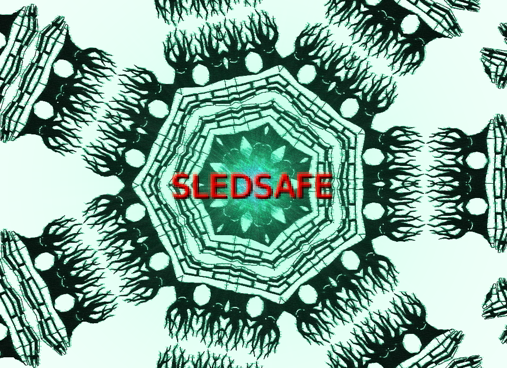

# SLEDSAFE

[](https://github.com/spacejam/sled)
[](https://docs.rs/sled)
[](https://discord.gg/Z6VsXds)
[](https://github.com/sponsors/spacejam)

This article introduces the SLEDSAFE initiative for making sled into a grown-up
database.

We discuss the following claims and how we set out to build confidence in them:

* lineariazable single-key concurrent operations
* serializable multi-key concurrent transactions
* space amplification of 3x under non-concurrent workloads

outline:
* [databases are hard](#databases-are-hard)
* [sled guarantees](#sled-guarantees)
* [safety is emergent behavior](#safety-is-emergent-behavior)
* [hazards](#hazards)
* [constraints](#constraints)
* [model checking](#model-checking)
* [lineage-driven fault injection](#lineage-driven-fault-injection)



After over 4 yers of fun, sled nears its January 2021 1.0 release date. There
is a proverb in the SRE community:

```
Never use a database less than 5 years old.
- Ancient SRE proverb
```

How can we ethically recommend that people use sled as a primary data store?

## Databases are Hard

Databases tend to take years to bake-in. Most databases never gain a trusted
status at all. Why do databases keep losing our data?

In [Files are hard](https://danluu.com/file-consistency/), Dan Luu goes into
quite a lot of detail about how nobody seems to be able to use files correctly.
Even the most trusted database, SQLite, has suffered bugs related to correct
file use. In [All File Systems Are Not Created Equal:On the Complexity of
Crafting Crash-Consistent
Applications](https://research.cs.wisc.edu/adsl/Publications/alice-osdi14.pdf),
the authors ran various widely-deployed file-using programs while recording
their file usage with a modified version of
[Strace](https://en.wikipedia.org/wiki/Strace). Based on their traces, they
generated various files that would have been possibly created during a crash at
different times based on the guarantees of various commonly deployed file
systems. Bugs were discovered in every system tested. SQLite stood out for only
having one issue discovered while operating in rollback mode. The SQLite
developers themselves claimed the system could not make durability guarantees
under this configuration.

Distributed databases seem to fare even worse. Nearly any system tested with
[Jepsen](https://jepsen.io) seems to break when simple network hiccups are
introduced while nodes are performing correctness-critical communication. The
paper [Simple Testing Can Prevent Most Critical
Failures]([http://www.eecg.toronto.edu/~yuan/papers/failure_analysis_osdi14.pdf)
seems to suggest that engineers tend not to test the error handling code in
popular distributed stateful systems.
[FoundationDB](https://apple.github.io/foundationdb/testing.html) seems to be
the SQLite of the distributed systems world in that their system is subjected
to intense simulation that teases out race conditions and performs
comprehensive fault injection that attempts to verify the system's ability to
maintain strict serializability in the face of a wide variety of adverse (yet
realistic) conditions.

While sled is not a distributed database, it is a concurrent database that
utilizes lock-free programming in correctness-critical areas to avoid blocking.
We will want to pay attention to FoundationDB's successes in fighting race
conditions and incorrect error handling by inducing delays and faults.

Martin Kleppmann's [Hermitage](https://github.com/ept/hermitage) project
demonstrates how a variety of popular databases today may implement wildly
different things when they claim to enforce particular isolation levels. Again,
FoundationDB is the outlier that seems to behave as it claims. The
[FoundationDB tests in
Hermitage](https://github.com/ept/hermitage/blob/master/foundationdb.md) can
serve as a nice basis for writing assertions of serializability in a
transactional test suite.

We seem to have a lot of difficulty when it comes to reasoning about the
correctness of files and concurrent systems with our brains. Our whiteboards
have failed us.

The correctness of sled depends on our ability to test its file usage and
concurrent behavior mechanically.

## sled guarantees

<a target="_blank"  href="https://www.amazon.com/gp/product/1558605088/ref=as_li_tl?ie=UTF8&camp=1789&creative=9325&creativeASIN=1558605088&linkCode=as2&tag=tylerneely06-20&linkId=a7a9012b79d64e3b0f269ca672ca7fe4"></a>


## safety is emergent behavior

<a target="_blank"  href="https://www.amazon.com/gp/product/0262533693/ref=as_li_tl?ie=UTF8&camp=1789&creative=9325&creativeASIN=0262533693&linkCode=as2&tag=tylerneely06-20&linkId=3268b7d6f43c5d8c29a4855ac5c3f5f6"></a>

[A New Accident Model for Engineering Safer Systems](http://sunnyday.mit.edu/accidents/safetyscience-single.pdf)

[A comprehensive safety engineering approach for software-intensive systems based on STPA](https://arxiv.org/pdf/1612.03109.pdf)

## hazards

## constraints

[SQLite Requirements](https://www.sqlite.org/requirements.html)

## model checking
<a target="_blank"  href="https://www.amazon.com/gp/product/3319105744/ref=as_li_tl?ie=UTF8&camp=1789&creative=9325&creativeASIN=3319105744&linkCode=as2&tag=tylerneely06-20&linkId=5bfc4620c24711908f25ac9987d044e6"></a>

[Experiences with QuickCheck:Testing the Hard Stuff and Staying Sane](https://www.cs.tufts.edu/~nr/cs257/archive/john-hughes/quviq-testing.pdf)

[Learn TLA+](https://learntla.com/introduction/example/)

## lineage-driven fault injection

[Lineage-Driven Fault Injection](https://people.ucsc.edu/~palvaro/molly.pdf)

1. run a workload, observing how it uses external resources like the network or files
1. the order that the system

[Some thoughts on security after ten years of qmail 1.0](https://cr.yp.to/qmail/qmailsec-20071101.pdf)

[How SQLite Is Tested](https://www.sqlite.org/testing.html)

[Optimal Stateless Model Checking under the Release-Acquire Semantics](https://arxiv.org/pdf/1808.00843.pdf)
* Abdulla's response to below

[Effective Stateless Model Checking for C/C++ Concurrency](https://plv.mpi-sws.org/rcmc/paper.pdf)
* response to CDSChecker & Nidhugg

[Source Sets: A Foundation for Optimal Dynamic Partial Order Reduction](http://user.it.uu.se/~parosh/publications/papers/jacm17.pdf)
* Abdulla (Nidhugg) describes a very nice DPOR

[CDSCHECKER:  Checking  Concurrent  Data Structures  Written  with  C/C++  Atomics](http://demsky.eecs.uci.edu/publications/c11modelcheck.pdf)

[Principles of Model Checking](http://is.ifmo.ru/books/_principles_of_model_checking.pdf)
* MIT book, simpler than "Handbook of Model Checking"

###### STAMP resources
* [A New Accident Model for Engineering Safer Systems](http://sunnyday.mit.edu/accidents/safetyscience-single.pdf)
* [STPA Handbook](http://psas.scripts.mit.edu/home/get_file.php?name=STPA_handbook.pdf)
* [CAST Handbook: How to Learn More from Incidents and Accidents](http://psas.scripts.mit.edu/home/get_file4.php?name=CAST_handbook.pdf)
* [Engineering a Safer World](https://www.dropbox.com/s/dwl3782mc6fcjih/8179.pdf?dl=1)
* [STAMP Publications](http://sunnyday.mit.edu/STAMP-publications-sorted.pdf)
